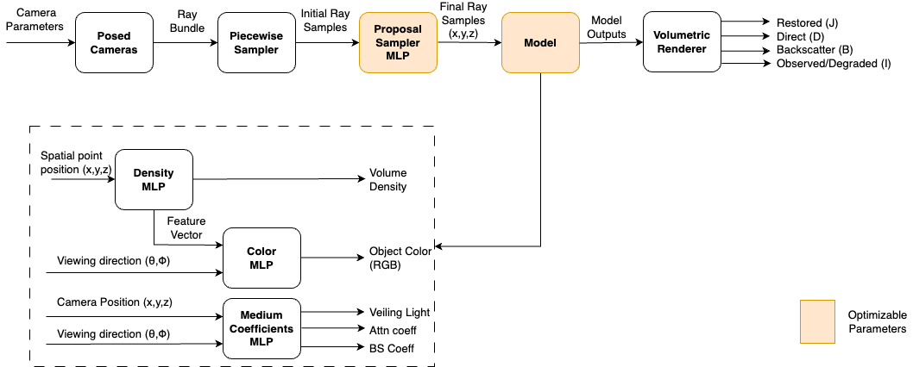
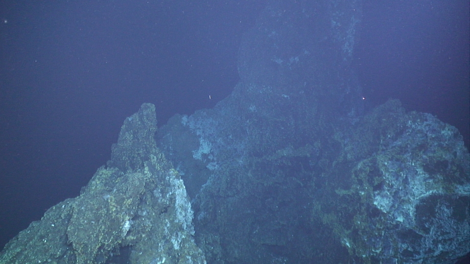
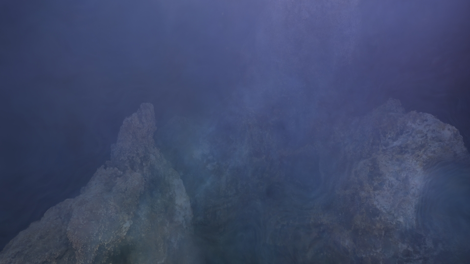
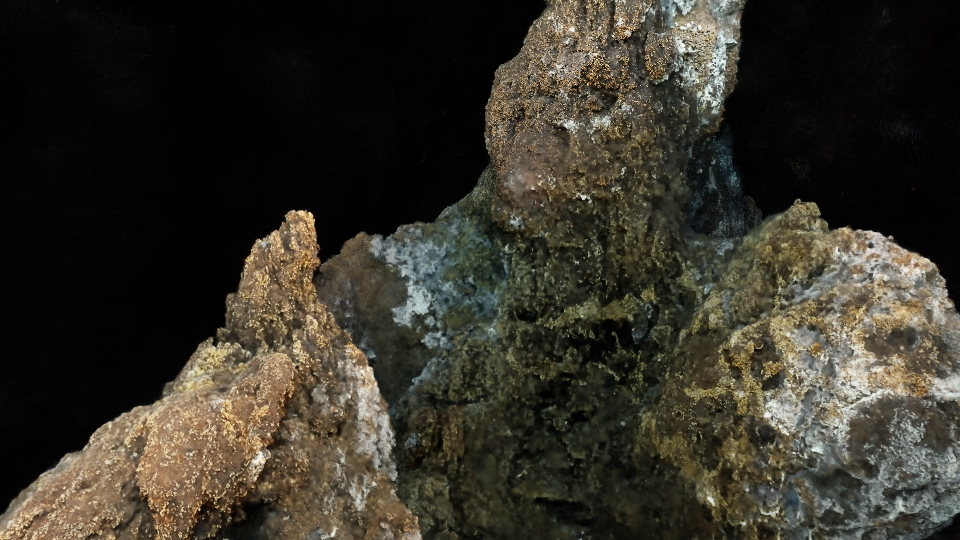

# **Neural Radiance Fields for High-fidelity Underwater Scene Reconstruction**

## **1. Project Overview**
This project investigates the application of Neural Radiance Fields (NeRFs) for restoring and representing high-fidelity underwater scenes. Underwater visual imaging often suffers from degradation due to various factors, with light attenuation and backscattering being the most significant. These degradation effects are functions of observation distances, making it challenging to consistently capture high-quality underwater images. Additionally, inconsistent images obscure relevant information, complicating analysis and high-fidelity reconstructions. Hence, this project aimed at estimating the degradation in an underwater image while training a NeRF model on the scene images. This would allow us to obtain a NeRF model that depicts the scene without water medium effects.

## **2. Contributions and Method**
We propose new volume rendering equations and neural field architecture to represent underwater scenes in this project. Our proposed method integrates a physics-based image restoration model (SeaThru) into the standard NeRF volume rendering equations. This simplifies the reconstruction problem to be a combination of multi-view object radiance estimation and color restoration. Consequently, by combining these rendering equations with our proposed NeRF architecture, we were able to obtain high-fidelity ‘Restored Underwater Scene Models’ which depict the actual scenes without the water degradation effects on the images observed, and the ‘Original Underwater Scene Models’ which represent the scenes and its water medium effects.

The final rendering equations proposed are:

$J(r) = \int_{t_n}^{t_f} T_o(t)\sigma_o(t)c_o(t, d)dt$

$D(r) = \int_{t_n}^{t_f} T_o(t)T_d(t)\sigma_o(t)c_o(t, d)dt$

$B(r) = \int_{t_n}^{t_f} T_o(t)(1 -T_b(t))\sigma_o(t)B^\infty_c(t)dt + \left(1 - \int_{t_n}^{t_f} T_o(t)\sigma_o(t)dt \right) B^\infty_c(t)$

$I(r) = D(r) + B(r)$

Here, $I$ represents the underwater scene image captured by the camera; $B^\infty$ is the veiling light or backscatter at infinity, $J$ indicates the actual unattenuated signal transmitted that would have been captured if there were no water medium effects, $D$ is the direct signal transmitted, $\sigma_o$ is the object's volume density, $B$ denotes the backscattered signal transmitted, $\beta_D$ is the light attenuation coefficient, and $\beta_B$ is the backscattering coefficient.

Additionally, we proposed a new NeRF architecture to account for the additional parameters as follows:

<div style="display: flex; flex-wrap: wrap; justify-content: space-around;">
  <div style="flex: 1; padding: 10px;">
    
    <p style="text-align: center;">Proposed Model Architecture</p>
  </div>
</div>


## **3. Results**
Our proposed method represents both shallow and deep-water environments with constant illumination and does not require pseudo-ground truth restored images to obtain the ‘Restored Underwater Scene Model’. It also outperforms other benchmarked methods qualitatively and quantitatively in most compared metrics and datasets. This validates its potential as a good representation technique for reconstructing underwater scenes.

### **3.1. Synthesized Eiffel Tower Actual Scene Images**

<div style="display: flex; flex-wrap: wrap; justify-content: space-around;">
  <div style="flex: 1; padding: 10px;">
    
    <p style="text-align: center;">Original Captured Image</p>
  </div>
  <div style="flex: 1; padding: 10px;">
    
    <p style="text-align: center;">Nerfacto Rendered Image</p>
  </div>
</div>
<div style="display: flex; flex-wrap: wrap; justify-content: space-around;">
  <div style="flex: 1; padding: 10px;">
    
    <p style="text-align: center;">SeaThru-NeRF Restored Image</p>
  </div>
  <div style="flex: 1; padding: 10px;">
    
    <p style="text-align: center;">Our Method's Restored Image</p>
  </div>
</div>


### **3.2. Quantitative Evaluation — Peak Signal-to-Noise Ratio (PSNR) $\uparrow$**

| &nbsp; | &nbsp; | Nerfacto | SeaThru-NeRF | **Our Method** |
|-------|--------|----------|---------------|----------------|
| Curasao | &nbsp; | 16.41 | 38.03 | **39.70** |
| IUI3 RedSea | &nbsp; | 15.99 | 37.56 | **39.56** |
| Japanese Gardens | &nbsp; | 18.62 | 39.79 | **40.16** |
| Panama | &nbsp; | 17.86 | 38.87 | **39.48** |
| Eiffel Tower 2015 | &nbsp; | 14.71 | 19.31 | **23.95** |
| Eiffel Tower 2016 | &nbsp; | 15.28 | 18.85 | **18.95** |
| Eiffel Tower 2018 | &nbsp; | 14.85 | 18.47 | **18.67** |
| Eiffel Tower 2020 | &nbsp; | 15.01 | 20.62 | **24.48** |

Both the qualitative and quantitative evaluation results show that our method is consistently better than other relevant methods.

## **4. Running this code**
For this project, we used two datasets: Eiffel Tower and SeaThru-NeRF datasets. And for the implementation, we used the [Nerfstudio](https://nerf.studio) API. Hence, both dependencies are required. 

- Clone this repository.
- Install Nerfstudio and its dependencies by following the steps outlined in [nerf.studio](https://nerf.studio).
- Prepare the datasets: Eiffel Tower and SeaThru-NeRF datasets, using the shell scripts provided in the `scripts` directory.
- Configure a NeRF model in the `experiments/v0/configs` directory.
- Train the configured nerf model using the `train.py` script.
- Render the scene using the `render.py` script.


To run this code on your dataset, prepare your COLMAP data similarly to the approaches highlighted in the `scripts/datasetup_eiffel.sh` script. If you do not have a COLMAP model for your data, you can explore additional approaches provided in the [Nerfstudio](https://nerf.studio) API documentation and modify the Dataparser and Datamanager instances in the `experiments/v0/configs/base_configs.py` script to account for the respective data loading changes.


## **5. Citation**
If you find this work useful for your research, please consider citing this work:

```
@misc{underwater_nerfs,
  title={Neural Radiance Fields for High-fidelity Underwater Scene Reconstruction},
  author={Oluwatobi Ojekanmi, Oscar Pizarro, Ricard Marxer},
  url={https://github.com/tobiojekanmi/undwerwater-nerfs},
  year={2024}
}
```
